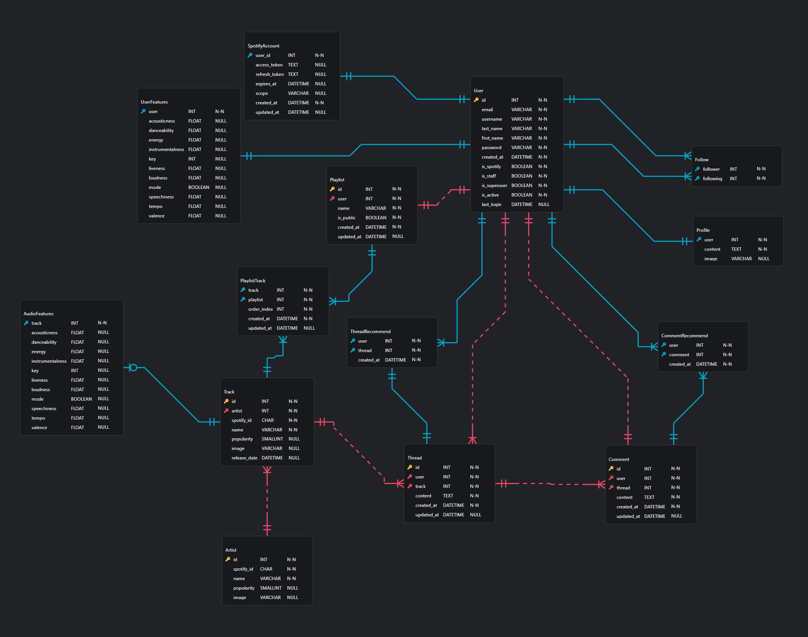

# UMME Project

## 1. 프로젝트 개요

**UMME**는 *음악을 매개로 사용자가 자신의 감상과 생각을 스레드 형태로 공유*할 수 있는 커뮤니티 서비스이다.

단순한 플레이리스트 공유를 넘어, **곡 하나를 중심으로 한 감상 기록과 사용자 간 소통**을 목표로 한다.

사용자는 음악을 검색하고 재생하며, 특정 곡에 대한 자신의 감상을 스레드로 작성할 수 있다.

또한 다른 사용자의 스레드를 탐색하고, 해당 사용자의 음악 취향 및 플레이리스트를 확인함으로써

음악 취향 기반의 커뮤니티 경험을 제공한다.

본 프로젝트는 **Frontend(Vue 3)** 와 **Backend(Django REST Framework)** 를 분리한 구조로 설계되었으며,

RESTful API를 기반으로 데이터 통신을 수행한다.

컴포넌트 단위의 UI 설계와 확장성을 고려한 아키텍처를 채택하였다.

---

## 2. 팀원 정보 및 업무 분담

###  팀 구성

| 이름 | 역할 | 담당 업무 |
| 박서연 | Frontend | Vue 기반 UI 구현,   AI 활용 |
| 김형택 | Backend | Django REST API 설계, DB 설계, Spotify API 연동 |

###  역할 상세

**박서연 (Frontend)**

- 프로젝트 기획 및 전체 구조 설계 참여
- Vue 3 Composition API 기반 UI 구현
- 생성형 AI 활용 및 문서 정리

**김형택 (Backend)**

- 프로젝트 기획 및 전체 구조 설계 참여
- Django REST Framework 기반 API 설계
- ERD 작성 및 데이터베이스 모델링
- 기능 구현
- Spotify API 연동 및 음악 데이터 처리

---

## 3. 목표 서비스 및 실제 구현 정도

###  목표 서비스

- 음악(곡) 기반 스레드 커뮤니티 서비스
- 사용자 스레드 기반 **Audio Features 분석**을 통한 취향 분석
- 사용자 입력 데이터 기반 **AI 스레드 추천 서비스**
- 음악 검색 서비스 (UMME 유저)
- 음악 재생 서비스 (UMME 유저 + Spotify 연동 유저)
- 스레드 좋아요 및 댓글 기능
- 유저 타입 기반 추천 기능

###  실제 구현 기능

- Spotify 플레이리스트를 연동한 **스레드 작성 폼**
- 스레드 전체 목록 및 스레드 상세 정보 조회
- 사용자 프로필 기능
    - 유저 취향 정보 조회
    - 플레이리스트 조회
    - 해당 유저의 스레드 목록 조회
    - 팔로우 기능
- 음악(곡) 기반 스레드 작성 및 조회
- RESTful API 기반 프론트-백엔드 통신
- 생성형 AI를 활용한 **스레드 검색/추천 보조 기능**

---

## 4. 데이터베이스 모델링

프로젝트의 데이터베이스는 사용자, 스레드, 음악 정보 간의 관계를 중심으로 설계되었다.

Spotify API에서 제공하는 트랙 정보를 기반으로 Audio Features를 저장하고,

이를 통해 사용자 취향 분석 및 추천 기능 확장이 가능하도록 구성하였다.

> ERD 다이어그램

---

## 5. 추천 알고리즘 기술 설명

본 프로젝트의 추천 기능은 **RAG(Retrieval-Augmented Generation)** 개념을 참고하여 설계되었다.

###  왜 RAG 방식이 적절한가?

- 사용자 입력은 단순한 질문이 아닌 **검색 의도 또는 취향 표현**에 가깝다.
- 새로운 텍스트를 생성하기보다는,
    
    **이미 데이터베이스에 존재하는 스레드 중 적절한 결과를 찾는 것**이 핵심이다.
    
- 생성형 AI를 단독으로 사용하기보다는,
    
    **기존 데이터 검색 + AI 보조 판단** 구조가 프로젝트 목적에 부합한다.
    

### ⚙️ 동작 방식

1. 사용자 검색어 또는 입력 데이터 수집
2. 데이터베이스에서 관련 스레드 필터링
3. 유사도가 높은 상위 20개 스레드 추출
4. 해당 데이터를 기반으로 사용자에게 결과 제공

이를 통해 불필요한 텍스트 생성 없이,

기존 스레드를 효율적으로 활용하는 추천 구조를 구현하였다.

---

## 6. 생성형 AI 활용

###  활용 목적

- 개발 과정 중 코드 리팩토링 및 구조 개선 보조
- 커밋 메시지 작성 및 문서 정리 보조
- 데이터베이스에 사용할 사용자/스레드 더미 데이터 생성

###  활용 도구

- **ChatGPT**
- **Gemini CLI**

**개발 생산성을 높이기 위한 보조 도구**로 활용하였다.

---

## 7. 구현 과정에서 학습한 내용

###  기술적 학습

- Vue 3 Composition API (`ref`, `onMounted`)의 활용
- 비동기 요청 흐름의 이해, `async/await`를 활용한 안정적인 데이터 로딩 구현
- 컴포넌트 단위 설계의 중요성
- RESTful API 구조에 대한 이해
- 프론트엔드와 백엔드 분리 개발 경험
- Git 기반 협업 및 버전 관리의 중요성

###  어려웠던 점

- 프론트엔드와 백엔드 역할 분리로 인한 소통의 어려움
- Git 충돌과 코드 유실, 브랜치 관리
- 컴포넌트 분리 기준 설정의 어려움
- API 응답 데이터 구조 파악 및 필요한 데이터 추출
- 의존성 충돌 및 환경 설정 문제

###  새로 배운 점 및 느낀 점

- 명확한 API 설계와 소통의 중요성
- UI가 아닌 **역할 중심 설계**의 필요성
- 작은 단위의 커밋과 브랜치 관리 습관
- 공식 문서를 기반으로 한 문제 해결 능력 향상
- 목적에 맞는 AI 활용에 대한 이해

## 8. 마무리

UMME 프로젝트를 통해 음악 데이터를 활용한 커뮤니티 서비스 설계부터

프론트엔드와 백엔드 협업, AI 활용 방식까지 전반적인 웹 서비스 개발 과정을 경험할 수 있었다.

향후 댓글 기능, 사용자 타입 기반 추천,

더 정교한 추천 알고리즘을 추가하여 서비스 확장을 계획하고 있다.