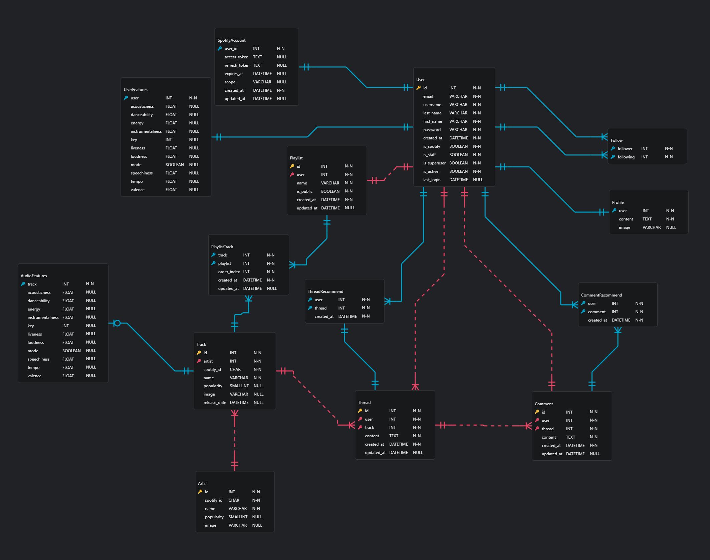

<div align="center">
  <h1>UMME</h1>
  <h3>음악으로 연결되는 감상 공유 커뮤니티</h3>
  <h4>곡 하나를 중심으로 스레드, 플레이리스트, 취향을 함께 탐색하는 <b>음악 커뮤니티 서비스</b>입니다.</h4>
</div>

<br/>

- **개발 기간** : 2025.12.16 ~ 2025.12.19 **(4일)**
- **플랫폼** : Web
- **개발 인원** : 2명
- **담당자** : 김형택
- **기관** : 삼성 청년 SW · AI 아카데미 14기

---

## 🔎 목차

- [🙌 팀원 구성](#-팀원-구성)
- [🎧 프로젝트 소개](#-프로젝트-소개)
- [🪄 기술 스택](#-기술-스택)
- [🛠️ 아키텍처](#-아키텍처)
- [📲 주요 기능](#-주요-기능)
- [🧠 추천 검색 구조](#-추천-검색-구조)
- [📂 디렉터리 구조](#-디렉터리-구조)
- [🚀 로컬 실행](#-로컬-실행)
- [📦 프로젝트 산출물](#-프로젝트-산출물)

---

## 🙌 팀원 구성

<table align="center">
  <tr>
    <td align="center" width="50%">
      <b>박서연</b>
      <br/>
      <b>Frontend</b>
      <ul>
        <li>Vue 3 기반 화면 및 컴포넌트 구현</li>
        <li>홈, 프로필, 스레드 작성/상세 UI 구현</li>
        <li>생성형 AI 활용 및 문서 정리</li>
      </ul>
    </td>
    <td align="center" width="50%">
      <b>김형택</b>
      <br/>
      <b>Backend</b>
      <ul>
        <li>Django REST API 설계 및 구현</li>
        <li>데이터베이스 모델링 및 ERD 작성</li>
        <li>Spotify API, ReccoBeats API, RAG 검색 연동</li>
      </ul>
    </td>
  </tr>
</table>

---

## 🎧 프로젝트 소개

**UMME**는 음악을 매개로 사용자가 자신의 감상과 생각을 스레드 형태로 공유할 수 있는 커뮤니티 서비스입니다.

단순한 플레이리스트 공유를 넘어, **곡 하나를 중심으로 한 감상 기록과 사용자 간 소통**을 목표로 합니다. 사용자는 Spotify 기반 음악 검색과 재생을 활용해 곡을 탐색하고, 특정 곡에 대한 감상을 스레드로 작성할 수 있습니다.

다른 사용자의 스레드, 프로필, 플레이리스트를 탐색하며 음악 취향을 발견할 수 있고, RAG 기반 검색을 통해 기존 스레드 중 사용자 의도와 가까운 감상 글을 추천받을 수 있습니다.

---

## 🪄 기술 스택

<div align="center">

### 🫡 Frontend


<table>
  <tr>
    <th>Category</th>
    <th>Specification</th>
  </tr>
  <tr>
    <td><b>Framework</b></td>
    <td>Vue 3.5.25</td>
  </tr>
  <tr>
    <td><b>Build Tool</b></td>
    <td>Vite 7.2.4</td>
  </tr>
  <tr>
    <td><b>State Management</b></td>
    <td>Pinia 3.0.4, Pinia Plugin Persistedstate 4.7.1</td>
  </tr>
  <tr>
    <td><b>Router</b></td>
    <td>Vue Router 4.6.3</td>
  </tr>
  <tr>
    <td><b>UI</b></td>
    <td>Bootstrap 5.3.8, Bootstrap Icons 1.13.1, Phosphor Icons Vue 2.2.1</td>
  </tr>
  <tr>
    <td><b>HTTP Client</b></td>
    <td>Axios 1.13.2</td>
  </tr>
  <tr>
    <td><b>Music Player</b></td>
    <td>Spotify Web Playback SDK</td>
  </tr>
  <tr>
    <td><b>Node.js</b></td>
    <td>^20.19.0 || >=22.12.0</td>
  </tr>
</table>

### 🤓 Backend


<table>
  <tr>
    <th>Category</th>
    <th>Specification</th>
  </tr>
  <tr>
    <td><b>Framework</b></td>
    <td>Django 5.2.9, Django REST Framework 3.16.1</td>
  </tr>
  <tr>
    <td><b>Auth</b></td>
    <td>dj-rest-auth 7.0.1, django-allauth 65.13.1, Simple JWT 5.5.1</td>
  </tr>
  <tr>
    <td><b>Database</b></td>
    <td>SQLite3, Django ORM</td>
  </tr>
  <tr>
    <td><b>External API</b></td>
    <td>Spotify API, ReccoBeats Audio Features API</td>
  </tr>
  <tr>
    <td><b>API Client</b></td>
    <td>Spotipy 2.25.2, Requests 2.32.5</td>
  </tr>
  <tr>
    <td><b>CORS / Env</b></td>
    <td>django-cors-headers 4.9.0, python-dotenv 1.2.1</td>
  </tr>
</table>

### 🧐 AI / Data


<table>
  <tr>
    <th>Category</th>
    <th>Specification</th>
  </tr>
  <tr>
    <td><b>Vector DB</b></td>
    <td>ChromaDB 1.4.0</td>
  </tr>
  <tr>
    <td><b>Embedding</b></td>
    <td>jhgan/ko-sroberta-multitask, Sentence Transformers 5.2.0</td>
  </tr>
  <tr>
    <td><b>ML / NLP</b></td>
    <td>PyTorch 2.9.1, Transformers 4.57.3, scikit-learn 1.8.0</td>
  </tr>
  <tr>
    <td><b>Retrieval</b></td>
    <td>Thread content embedding, TOP_K 20</td>
  </tr>
  <tr>
    <td><b>Data</b></td>
    <td>ERD(vuerd), Thread test data(JSON)</td>
  </tr>
</table>

### 😀 Collaboration / AI Tools


</div>

---

## 🛠️ 아키텍처

```text
Vue 3 SPA
  |-- Pinia Store
  |-- Vue Router
  |-- Spotify Web Playback SDK
  |
  | REST API / Cookie JWT
  v
Django REST API
  |-- accounts : 회원, 프로필, 팔로우, Spotify 계정
  |-- musics   : 음악 검색, 플레이리스트, 재생, Audio Features
  |-- threads  : 스레드 작성, 목록, 상세, 좋아요
  |-- rag      : 스레드 임베딩 검색
  |
  | ORM / External API
  v
SQLite3 + Spotify API + ReccoBeats API + ChromaDB
```

---

## 📲 주요 기능

| 기능 | 설명 |
| :-- | :-- |
| 회원 인증 | dj-rest-auth와 JWT Cookie 기반 회원가입, 로그인, 로그아웃 |
| 사용자 프로필 | 프로필 소개/이미지 수정, 사용자의 플레이리스트와 스레드 조회 |
| 팔로우 | 사용자 간 팔로우/언팔로우 및 팔로잉 기반 스레드 필터 |
| Spotify 연동 | OAuth 인증, 재생 토큰 발급, 디바이스 전환, 트랙 재생 |
| 음악 검색 | Spotify Artist/Track 검색 및 아티스트 인기 트랙 조회 |
| 플레이리스트 | 트랙 추가/삭제, 사용자별 플레이리스트 관리 |
| Audio Features | ReccoBeats API 기반 곡 특성 저장 및 조회 |
| 스레드 커뮤니티 | 곡 기반 감상 스레드 작성, 전체/팔로잉/좋아요 목록, 상세 조회 |
| 스레드 좋아요 | 스레드별 좋아요 토글 및 좋아요한 스레드 조회 |
| RAG 검색 | 입력 문장과 유사한 기존 스레드를 벡터 검색으로 추천 |

---

## 🧠 추천 검색 구조

UMME의 추천 검색은 새로운 답변을 생성하기보다, **이미 작성된 스레드 중 사용자 의도와 가까운 감상 글을 찾아주는 Retrieval 중심 구조**입니다.

1. 스레드 본문과 트랙 메타데이터를 수집합니다.
2. `jhgan/ko-sroberta-multitask` 모델로 스레드 본문을 임베딩합니다.
3. ChromaDB 컬렉션에 문서, 메타데이터, 임베딩 벡터를 저장합니다.
4. 사용자의 검색어를 동일한 모델로 임베딩합니다.
5. 유사도가 높은 상위 20개 스레드를 조회하고 트랙 정보를 함께 반환합니다.

---

## 📂 디렉터리 구조

```text
.
|-- README.md
|-- ERD.png
|-- thread_testcase.json
|-- package-lock.json
|-- backend
|   |-- manage.py
|   |-- requirements.txt
|   |-- umme
|   |   |-- settings.py
|   |   |-- urls.py
|   |   |-- asgi.py
|   |   `-- wsgi.py
|   |-- accounts
|   |-- musics
|   |-- threads
|   `-- rag
|       |-- config
|       |-- ingestion
|       |-- retrieval
|       `-- management
|-- data
|   |-- README.md
|   `-- erd.vuerd.json
`-- frontend
    `-- umme
        |-- package.json
        |-- vite.config.js
        |-- index.html
        `-- src
            |-- api
            |-- assets
            |-- components
            |-- router
            |-- stores
            |-- styles
            `-- views
```

---

## 🚀 로컬 실행

### Backend

```bash
cd backend
python -m venv venv
.\venv\Scripts\activate
pip install -r requirements.txt
python manage.py migrate
python manage.py runserver
```

Backend `.env` 예시:

```env
DJANGO_SECRET_KEY=
DJANGO_DEBUG_MODE=True
DJANGO_ALLOWED_HOSTS=localhost,127.0.0.1
DJANGO_ALLOWED_ORIGINS=http://localhost:5173
DJANGO_TRUSTED_ORIGINS=http://localhost:5173
VUE_BASE_URL=http://localhost:5173
SPOTIFY_CLIENT_ID=
SPOTIFY_CLIENT_SECRET=
SPOTIFY_REDIRECT_URI=
```

### Frontend

```bash
cd frontend/umme
npm install
npm run dev
```

Frontend `.env` 예시:

```env
VITE_CLIENT_ID=
VITE_REDIRECT_URI=
```

---

## 📦 프로젝트 산출물

### 🗄️ ERD



### 📑 데이터 설계 파일

- `data/erd.vuerd.json`
- `thread_testcase.json`

### 🤖 생성형 AI 활용

- 코드 리팩토링 및 구조 개선 보조
- 커밋 메시지 작성 및 문서 정리 보조
- 사용자/스레드 더미 데이터 생성 보조
